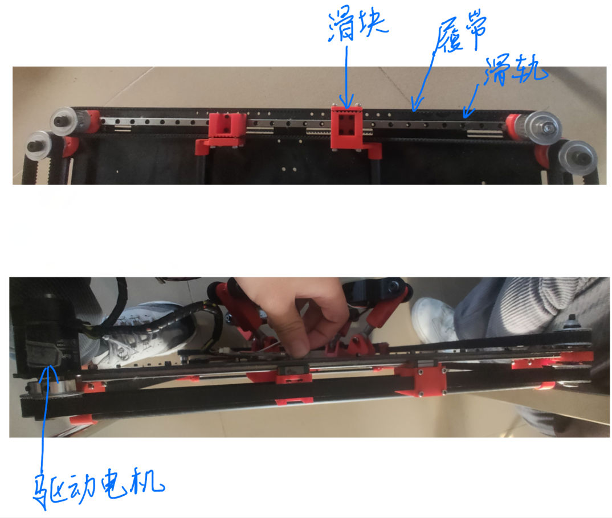

# 寒假任务

| 任务                                   | 负责人     | 完成时间                             | 备注                                  |
| -------------------------------------- | ---------- | ------------------------------------ | ------------------------------------- |
| 蓝色底板                               | 晨晗       | 1.23初步设计完成（有需要调整的部分） | 1月28日之前完成                       |
| 通信模块 COMMUNICATIONS MODULE BLOCK   | 黄楠       |                                      | 1月28日之前完成                       |
| 桅杆底座 MAST BLOCK                    | 方旭       |                                      | 1月28日之前完成                       |
| 桅杆和上面的东西组装成装配体           | 洋铭       |                                      | 1月30日之前完成                       |
| 滑轨设计、建模（电机用motion进行仿真） | 博涛、洋铭 |                                      | 详细见 滑轨说明.png。2月10日之前完成  |
| 滑轨与框架之间连接的设计               | 晨晗       |                                      | 2月15日之前完成                       |
| 滑块与通信模块连接之间的设计           | 洋铭、黄楠 |                                      | 开学了 会3d打印出来 。2月10日之前完成 |
| 整体系统设计                           | ALL        |                                      | 头脑风暴！                            |
| 抓取通信模块的抓手设计                 | 方旭、博涛 |                                      | 2月15日之前完成                       |
| 整体组装成装配体                       | 洋铭       |                                      | 2月15日之前完成                       |

